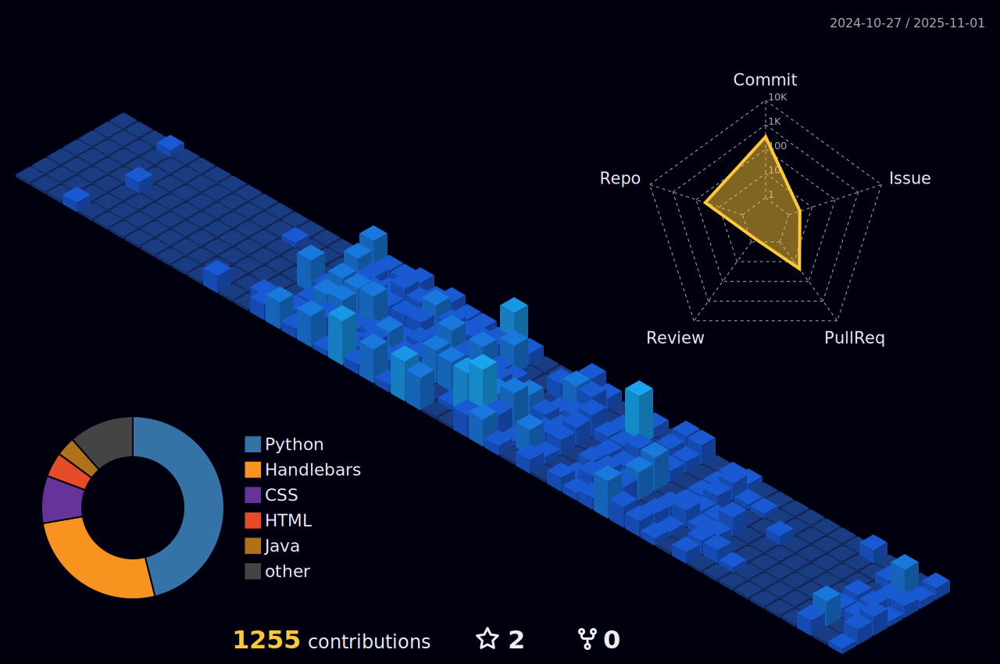

  

  <h1>Hi, I'm Maaz Waheed 👋</h1>
  
Student developer focused on AI, LLMs, and Machine Learning — building useful things.

  
  

---

### 🛠 Tech I use

  

---

### 🚀 Featured — AI, LLM & ML
- [OmniRegress](https://github.com/42Wor/OmniRegress) — The fast, modern Python & Rust library for all your regression adventures. A comprehensive toolkit for regression analysis.
- 🤖 [ChatAPI — AI Chat Assistant](https://github.com/MIbnEKhalid/ChatAPI) — Modern AI chat app powered by Google Gemini API with user management, conversation history, and admin dashboard. Team project.
- [Gas Plant Predictive Maintenance Model](https://github.com/42Wor/Gas-plant-failure-predictor) — LSTM-based RUL prediction for proactive maintenance and failure prevention.
- [Regression](https://github.com/42Wor/Regression) — Clear, from-scratch linear regression implementation to illustrate fundamentals.

### 🧰 Dev Tools & Web
- [MBKAUTHEPY](https://github.com/42Wor/mbkauthepy) — Secure, extensible authentication system for Flask. Ported from Node.js for multi-language full‑stack support.

- [WebPortal](https://github.com/MIbnEKhalid/WebPortal) Portal MBK Tech Studio is a comprehensive web application built with Node.js, Express, and Handlebars. It provides a modern dashboard interface with robust user management, security features, markdown editing capabilities, AI integration, and comprehensive analytics. The application uses PostgreSQL databases with Redis for session management and includes advanced security monitoring.

  
More projects

  
- [M-DEV Portfolio](https://github.com/42Wor/M-DEV) — Responsive personal site.
- [M-DEV Chat](https://github.com/42Wor/M-DEV-Chat) — Real‑time chat with Socket.IO.
- [maazDB (Python)](https://github.com/42Wor/maazDB_python) — Tiny NoSQL library for Python.
- [maazDB (JavaScript)](https://github.com/42Wor/maazDB_js) — Lightweight NoSQL for JS/Node.
- [Rust Learning Journey](https://github.com/42Wor/Rust-I-learn) — Notes and mini‑projects in Rust.
- [NotifyMe](https://github.com/42Wor/NotifyMe) — android application and Notification
 

---

### 📊 GitHub Stats

  
  

---

  
  

---

### ✉️ Connect
- Website: https://maaz-dev.vercel.app/
- Email: [maazwaheed@gmail.com](mailto:maazwaheed@gmail.com)
- GitHub: https://github.com/42Wor

Open to collaborations and learning together. Feel free to reach out!
